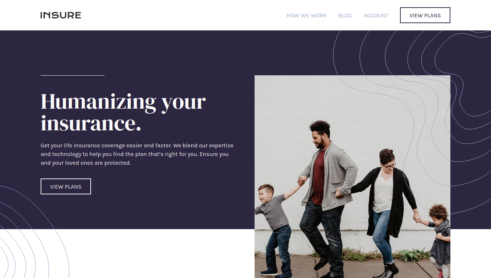

# Frontend Mentor - Insure landing page solution

This is a solution to the [Insure landing page challenge on Frontend Mentor](https://www.frontendmentor.io/challenges/insure-landing-page-uTU68JV8). Frontend Mentor challenges help you improve your coding skills by building realistic projects. 

## Table of contents

- [Overview](#overview)
  - [The challenge](#the-challenge)
  - [Screenshot](#screenshot)
  - [Links](#links)
- [Built with](#built-with)
- [Author](#author)
- [Acknowledgments](#acknowledgments)

**Note: Delete this note and update the table of contents based on what sections you keep.**

## Overview

### The challenge

Users should be able to:

- View the optimal layout for the site depending on their device's screen size
- See hover states for all interactive elements on the page

### Screenshot

### Links

- Solution URL: [Github](https://github.com/Dityath/frontendmentor-insure)
- Github URL: [Github](https://github.com/Dityath/frontendmentor-insure)
- Live Site URL: [Live Site](https://insure-landingpage-dityath.netlify.app/)

## Built with

- [Vue.js](https://vuejs.org/) - JS library
- [Nuxt.js](https://nuxtjs.org/) - Vue framework
- [Tailwind Css](https://tailwindcss.com/) - For styles

**Note: These are just examples. Delete this note and replace the list above with your own choices**

## Author

- Frontend Mentor - [@Dityath](https://www.frontendmentor.io/profile/Dityath)
- Twitter - [@bellezzasky](https://twitter.com/bellezzasky)

**Note: Delete this note and add/remove/edit lines above based on what links you'd like to share.**
